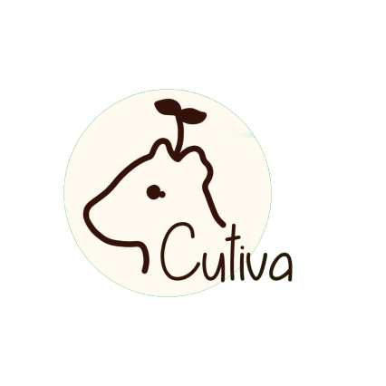
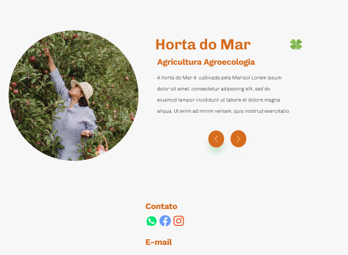
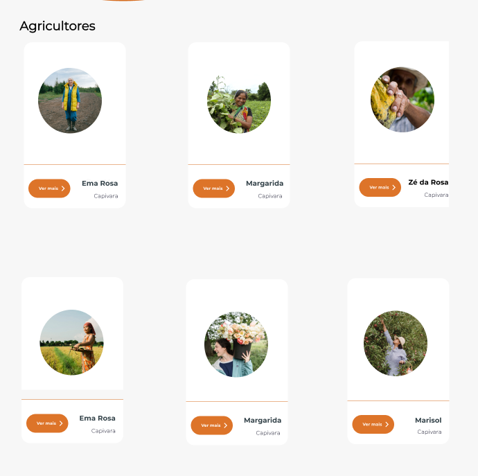
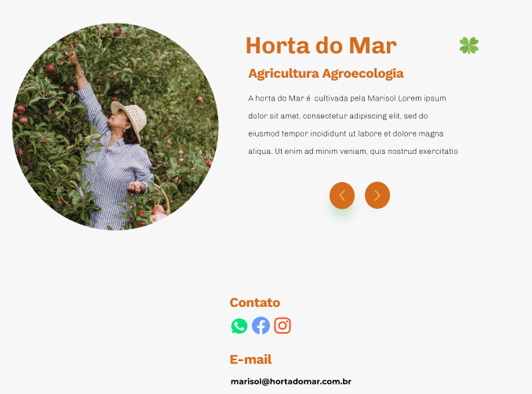

# cutiva


                         
# Sobre:
O Cutiva é um site que reúne informações importantes sobre agricultura familiar de sua região. Ele busca espaço em um mercado de compras cada vez mais digital, para enfrentar as dificuldades tecnológicas dos produtores. O site usa como estratégia de isca de marketing um blog com notícias sobre agricultura familiar e alimentação sustentável, e busca educar o leitor sobre a importância de comprar desses produtores regionais. É como uma agenda telefone, porém com mais recursos e respeitando os limites tecnológicos dos produtores, já que buscaremos as informações nas secretariais municipais. 
O projeto começa apenas em uma cidade, com pretensão de expansão. 
Os custos de manutenção do site dependerão do financiamento de organizações sociais.

# Gerenciamento do Projeto
- [Miro](https://miro.com/app/board/o9J_l1XzB6Q=/)
- [Diagrama](https://drive.google.com/file/d/15qPkVnxJyyJqRZBHhfXhvnS6KZ8sF6Te/view)
- [Figma](https://www.figma.com/proto/C3Dc1A2s4OHEUiCiNYpjwC/zou-farm-landing-page?node-id=42%3A3434&starting-point-node-id=42%3A3434)

# Cutiva - Back-end

## Pre-requisitos
- Node.js
- MongoDB

## Como rodar
- na raiz do projeto, no terminal:

```javascript
//baixar dependências
$ npm install

//rodar o projeto
$ npm run dev

```
## Variáveis de ambiente
- Na raiz do projeto crie um arquivo _.env_ conforme o arquivo _.env.default_, passando a url do seu banco local.
## Router
- Você pode testar pelo insomia ou postman.

### Post: Criando perfil de um(a) agricultor/agricultora

```
Post: /api/cutiva
```

- Exemplo <br>
_Body (json)_

```
{
    "title": "Horta do mar",
    "description": "A horta do Mar é cultivada ...",
    "name": "Marisol",
    "photoPerfil": "url",
    "typeAgriculture: "Agricultura Agroecologia"  
}
```
_router_ sendo consumida pelo front-end:



### Get - Listando todos agricultores ou passando condição

```
Get: api/cutiva/
```
_router_ sendo consumida pelo front-end:



### Get - Por id
Busca um único agricultor/agricultora
```
Get: api/cutiva/:id
//api/cutiva/617e42100fb4f4f9f474368e
```

### Put - Atualizando
```
put: api/cutiva/:id
//api/cutiva/617e42100fb4f4f9f474368e
```
Body:
```
{
    contact.email: "marisol@hortadomar.com.br
}
```
_router_ sendo consumida pelo front-end:



### delete - Deletando um agricultor/agricultora 
```
delete: api/cutiva/:id
//api/cutiva/617e42100fb4f4f9f474368e
```
### delete - Deletando todos os agricultores 

```
delete: api/cutiva/
```


# Jardiladies
<table>
  <tr>
    <td align="center"><a href=""><br /><sub><b>Juliana</b></sub></a><br /><a href="" title="Code">💻</a></td>
	  <td align="center"><a href="https://www.instagram.com/mariadeserrao/"><br /><sub><b>Ma de Serrão</b></sub></a><br/>:woman_astronaut:</td>
	  <td align="center"><a href="https://github.com/rayanepimentel"><br /><sub><b>Rayane Pimentel</b></sub></a><br />💻</td>
    <td align="center"><a href=""><br /><sub><b>Yara</b></sub></a><br />💻</td>
  </tr>
	
</table>
