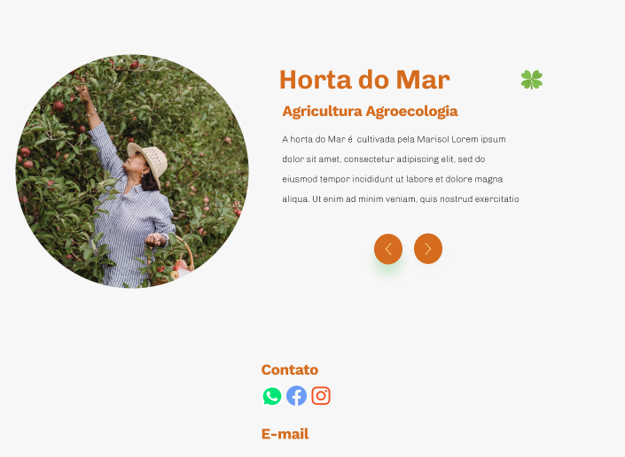

# cutiva


                         
## Sobre:
Olá, tudo bem? Nós somos a cutiva, estamos aqui para ajudar você na sua jornada em busca de alimentos produzidos pela agricultura sustentável. Nosso símbolo é a cutia, uma jardineira fiel à biordiversidade e o cultivo às sementes


# Cultiva - Back-end

## Pre-requisito
- Node.js
- MongoDB

## Como rodar
- na raiz do projeto, no terminal:

```javascript
//baixar dependências

$ npm install

//rodar o projeto
$ npm run dev

```
## Variáveis de ambiente
- Na raiz do projeto crie arquivo .env conforme o arquivo .env.default, passando a url do seu banco local
## Router
- Você pode testar pelo insomia ou postman.

### Criando perfil de um(a) agricultor/agricultora

```
get: /api/cutiva
```

- Exemplo

```
{
    "title": "Horta do mar",
    "description": "A horta do mar é cultivada ...",
    "name": "Marisol",
    "photoPerfil": "url",
    "typeAgriculture: "Agricultura Agroecologia"  
}
```


